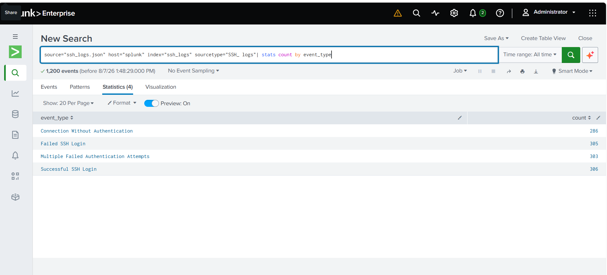
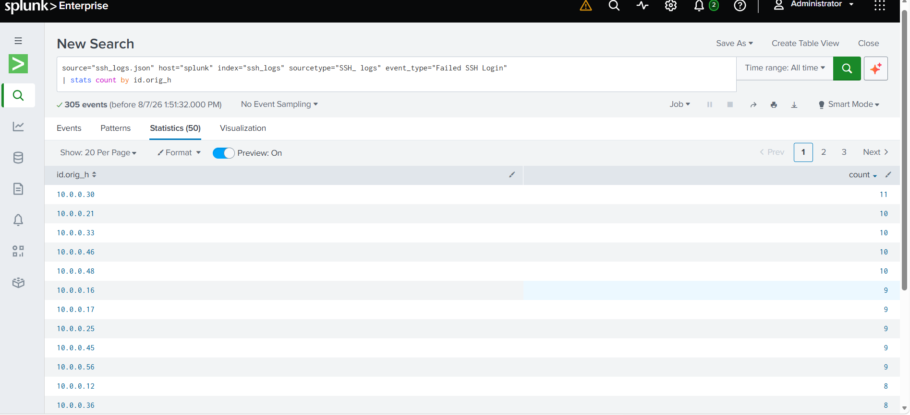
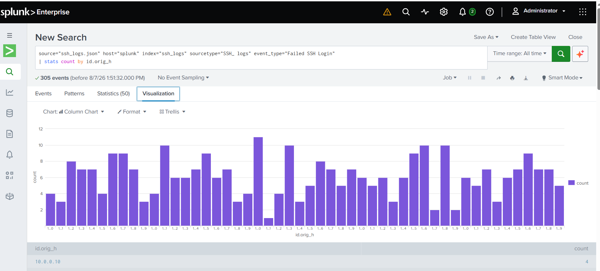
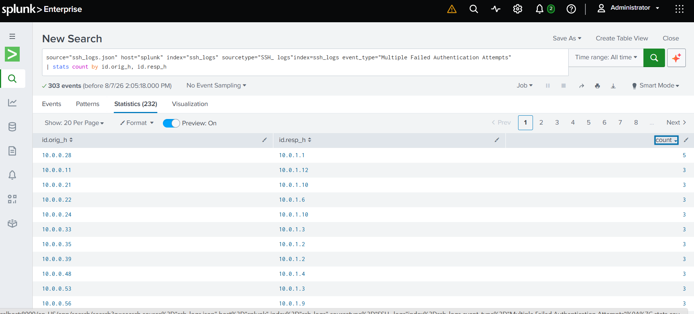
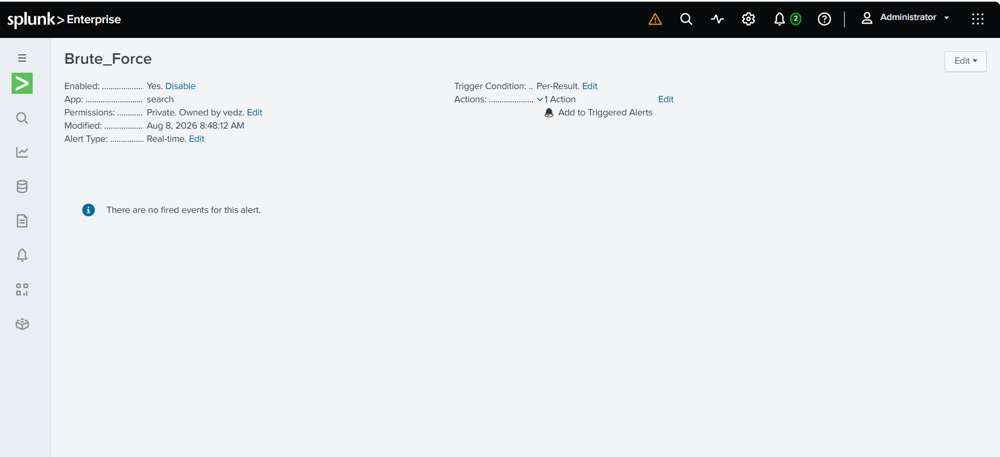
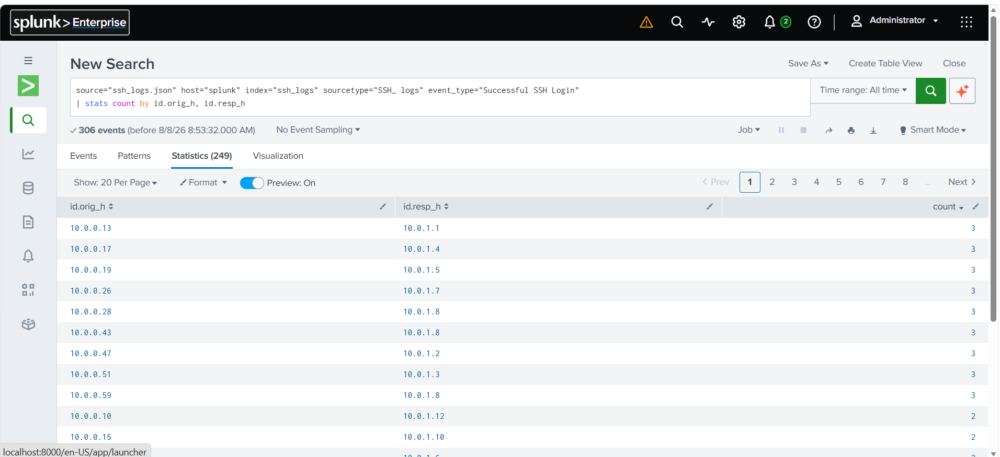
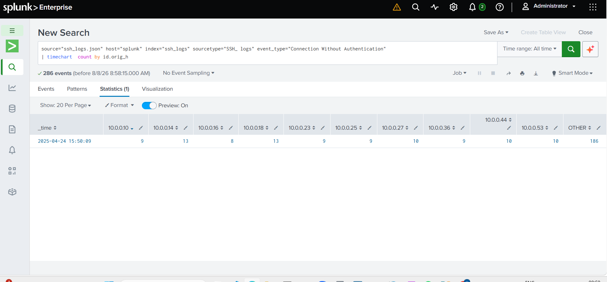
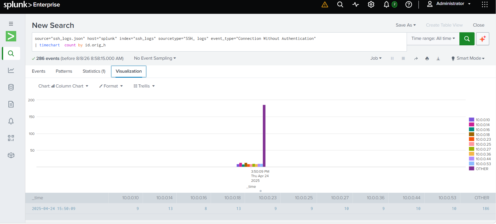

Haan bhai. Ab **tumhare actual uploaded filenames ke according** README bana raha hoon. PDF bhi mention hai. **Isko poora ek saath copy-paste karna** — kuch alag se nahi.

````markdown
# SSH Log Analysis using Splunk

## Overview

This project demonstrates hands-on SSH authentication log analysis and security monitoring using Splunk.

The project focuses on analyzing SSH logs to identify successful logins, failed login attempts, repeated authentication failures, possible brute-force activity, and connections without authentication.

Splunk was used to ingest JSON-based SSH logs, extract relevant fields, perform SPL-based analysis, create visualizations, build dashboards, and configure security alerts.

## Objective

The main objectives of this project are:

- Analyze successful SSH logins.
- Identify failed SSH login attempts.
- Detect multiple failed authentication attempts.
- Identify potential brute-force attacks.
- Analyze source and destination IP addresses.
- Identify connections without authentication.
- Create Splunk visualizations and dashboards.
- Configure alerts for suspicious authentication activity.
- Develop practical SOC Analyst log-analysis skills.

## Lab Setup

### Tools & Technologies

- Splunk
- SPL (Search Processing Language)
- SSH Authentication Logs
- JSON Log Data
- Splunk Dashboards
- Splunk Alerts
- IP Address Analysis

## Task 1: Ingest and Parse SSH Logs

The SSH log file was uploaded into Splunk and configured with the `_json` sourcetype so that relevant fields could be automatically extracted.

Important fields analyzed during the project include:

- `event_type`
- `auth_success`
- `auth_attempts`
- `id.orig_h`
- `id.resp_h`

### Validation Search

```spl
index=ssh_log
| stats count by event_type
````

This search validates the SSH events available in the dataset and provides a count for each event type.

### Screenshot



## Task 2: Analyze Failed Login Attempts

Failed SSH login attempts were analyzed to identify source IP addresses generating repeated authentication failures.

### Failed Login Analysis

```spl
index=ssh_logs event_type="Failed SSH Login"
| stats count by id.orig_h
```

This search groups failed login attempts by source IP address.

The results can be used to identify IP addresses generating a high number of failed authentication attempts.

### Failed Login Visualization

A bar chart was created to visualize failed SSH login attempts by source IP address.





## Task 3: Detect Multiple Failed Authentication Attempts

Multiple failed authentication attempts were analyzed as potential indicators of brute-force activity.

### Brute-Force Analysis

```spl
index=ssh_logs event_type="Multiple Failed Authentication Attempts"
| stats count by id.orig_h, id.resp_h
```

This search identifies repeated authentication failures by source and destination IP address.

Repeated authentication attempts from the same source can indicate possible brute-force or password-spraying activity.

### Brute-Force Detection Alert

A Splunk alert was configured to identify suspicious authentication activity when an IP address generates more than 5 login attempts within a 10-minute period.





## Task 4: Track Successful SSH Logins

Successful SSH authentication events were analyzed to identify which source IP addresses successfully connected to the destination host.

### Successful Login Analysis

```spl
index=ssh_logs event_type="Successful SSH Login"
| stats count by id.orig_h, id.resp_h
```

This analysis provides visibility into successful SSH connections and can help investigate potentially compromised accounts when successful authentication follows repeated failed attempts.



## Task 5: Identify Connections Without Authentication

SSH connections without successful authentication were analyzed as potentially suspicious activity.

### Unauthenticated SSH Connections

```spl
index=ssh_logs event_type="Connection Without Authentication"
| stats count by id.orig_h
```

This search identifies source IP addresses associated with unauthenticated SSH connections.

### Unauthenticated Connections Over Time

```spl
index=ssh_logs event_type="Connection Without Authentication"
| timechart count by id.orig_h
```

A time-based visualization was created to monitor unauthenticated SSH connections and identify repeated or unusual activity over time.





## Dashboard and Analysis

The project provides visibility into multiple aspects of SSH security monitoring:

* Successful authentication activity
* Failed authentication attempts
* Repeated authentication failures
* Potential brute-force attacks
* Source IP analysis
* Destination host analysis
* Unauthenticated SSH connections
* Authentication activity over time

## Key Security Findings

The analysis provides useful indicators for SOC monitoring, including:

* Source IP addresses generating repeated failed login attempts.
* Multiple authentication failures that may indicate brute-force activity.
* Successful SSH logins that can be investigated against previous failed attempts.
* Unauthenticated SSH connections that may indicate scanning or SSH probing.
* Authentication activity patterns that can be monitored over time.

## Dashboard Report

A PDF report containing the SSH analysis results is also included in the repository.

[View SSH Log Analysis Report (PDF)](successful-ssh-login.pdf)

## Project Structure

```text
ssh-log-analysis-splunk/
│
├── README.md
│
├── task1-ingestion.png
│
├── task2-failed-logins.png
├── task2-failed-logins_chart.png
│
├── task3-brute-force.png
├── task3-brute-force-alert.png
│
├── task4-successful-logins.png
│
├── Unauthenticated SSH connections_stats.png
├── Unauthenticated SSH connections_chart.png
│
├── successful-ssh-login.pdf
│
└── ssh-log-analysis.spl
```

## Skills Demonstrated

**Splunk** • **SPL** • **SSH Log Analysis** • **Linux Security Monitoring** • **Authentication Analysis** • **Brute-Force Detection** • **Threat Detection** • **IP Analysis** • **Security Alerts** • **Dashboard Development** • **Log Analysis**

## Conclusion

This project demonstrates practical SOC Analyst-level SSH log analysis using Splunk. It covers log ingestion, field extraction, SPL-based investigation, visualization, brute-force detection, alert configuration, and monitoring of suspicious SSH activity.

## Disclaimer

This project was created for educational and cybersecurity lab purposes using sample SSH log data. No production or confidential logs are included.

````

 
